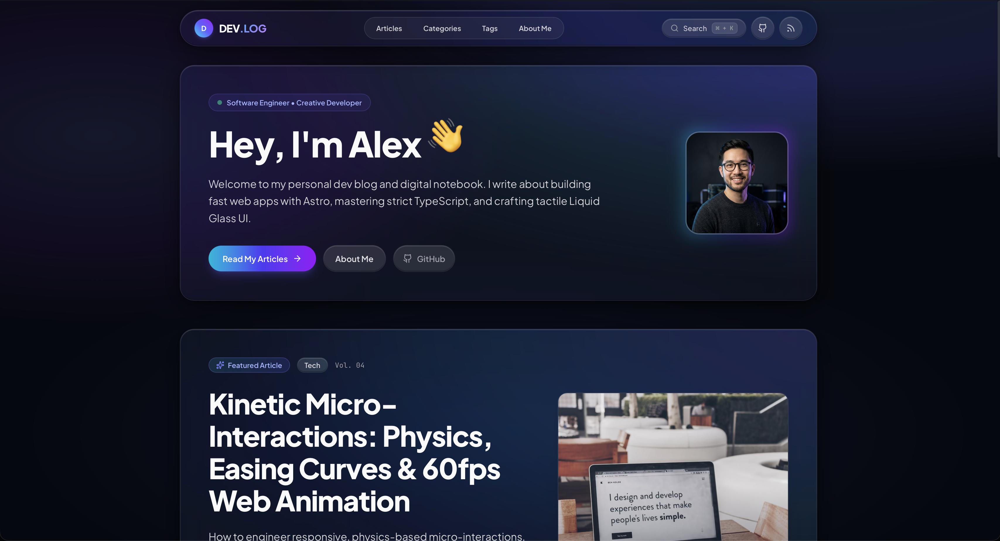
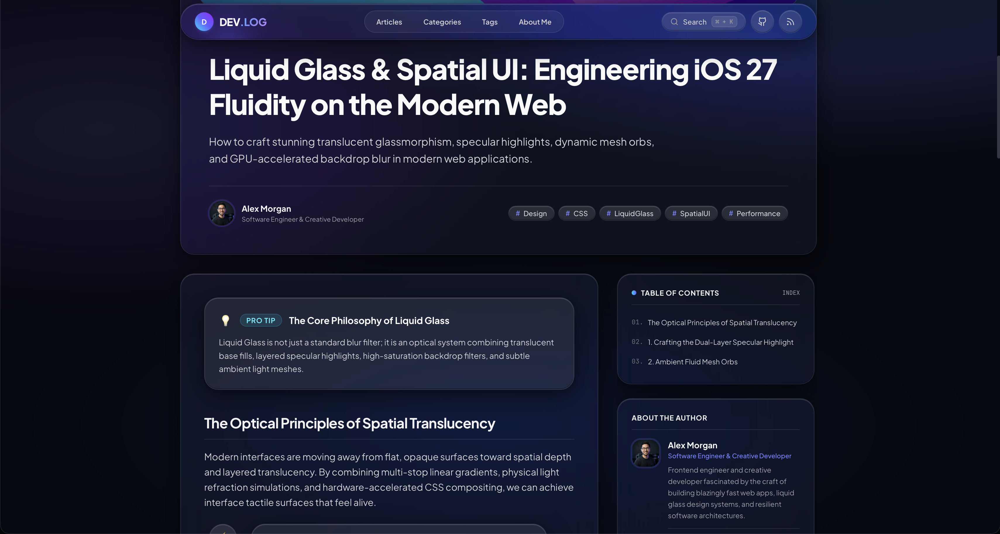
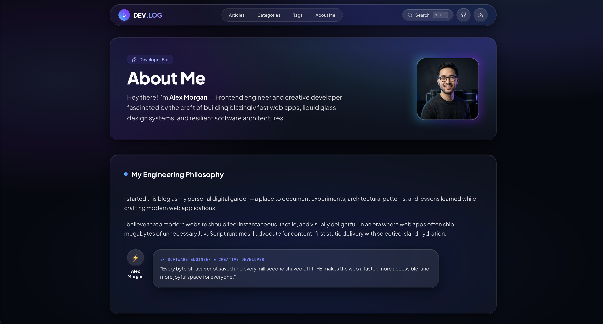
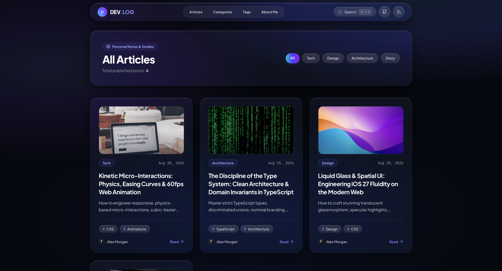
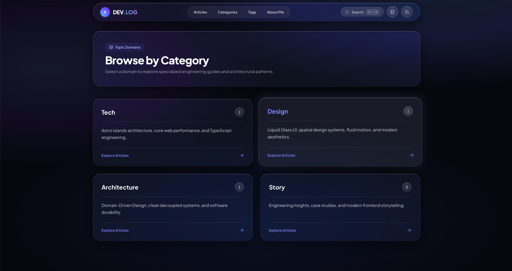
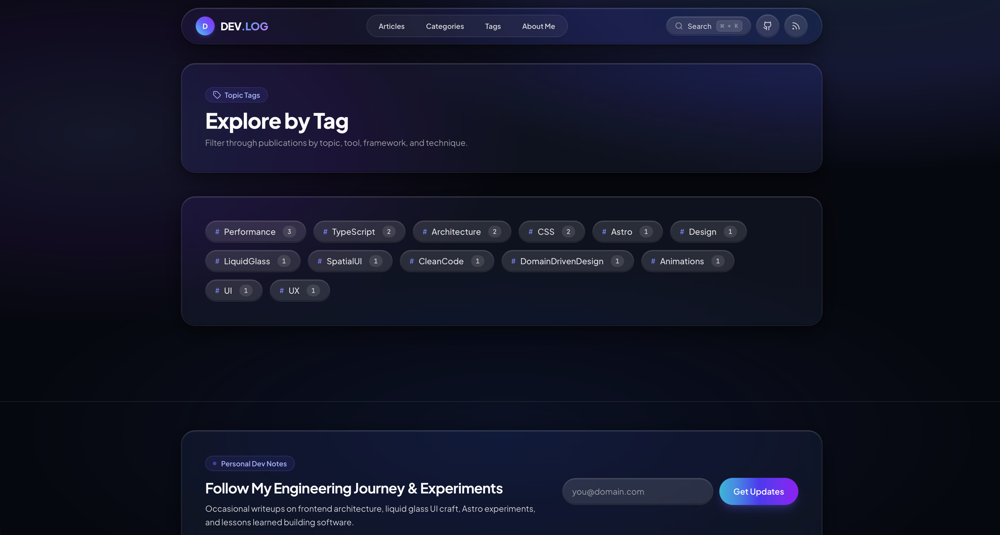

<div align="center">

# 🌐 DEV.LOG — Personal Developer Blog & Digital Garden

**A high-performance personal developer blog, digital notebook, and portfolio template.**  
Crafted with **Astro 7**, **Tailwind CSS 4**, strict **TypeScript**, and a tactile **Liquid Glass Dark UI**.

[](./LICENSE)
[](https://app.netlify.com/projects/devblogsite/deploys)
[](https://devblogsite.netlify.app)
[](https://astro.build)
[](https://tailwindcss.com)
[](https://www.typescriptlang.org)
[](https://pagefind.app)
[](https://www.docker.com)
[](./.github/workflows/ci.yml)

[**Explore Live Demo »**](https://devblogsite.netlify.app) · [**Report Bug »**](https://github.com/nivinvysakh/devlog-astro-template/issues) · [**Request Feature »**](https://github.com/nivinvysakh/devlog-astro-template/issues)

</div>

---

## 📑 Table of Contents

- [✨ Key Features](#-key-features)
- [🚀 Live Demo & Screenshots](#-live-demo--screenshots)
- [⚡ 1-Minute Customization](#-1-minute-customization-single-config-file)
- [🛠️ Quick Start](#️-quick-start)
- [✍️ Writing Articles & MDX Components](#️-writing-articles--mdx-components)
  - [Frontmatter Schema](#1-frontmatter-schema-reference)
  - [Interactive Components](#2-interactive-mdx-components)
  - [Advanced Code Highlighting](#3-advanced-code-highlighting--diffs)
- [📂 Project Structure](#-project-structure)
- [🌐 Deployment](#-deployment-options)
- [🐳 Docker Support](#-docker-support)
- [🛡️ Automated CI & Dependabot](#️-automated-ci--dependabot)
- [📄 License & Credits](#-license--credits)

---

## ✨ Key Features

| Category | Features |
| :--- | :--- |
| **🚀 Framework & Core** | **Astro 7.2** Islands architecture, **Zero-JS** baseline by default, sub-50ms static delivery, and full SSR/SSG support. |
| **🎨 Design & Theme** | **Liquid Glass UI** built with **Tailwind CSS 4**, translucent frosted glass cards, dynamic ambient glow meshes, and smooth spring physics micro-interactions. |
| **🔍 Search & Indexing** | **Pagefind** client-side static full-text search with instant modal dialog and keyboard shortcut navigation (`Cmd+K` / `Ctrl+K`). |
| **📝 Rich Content & MDX** | Interactive MDX story components (`<Callout />`, `<ArchitecturePanel />`, `<SpeechBubble />`, `<CharacterAside />`) and **Astro Expressive Code** for syntax highlighting. |
| **⚡ 1-Minute Setup** | Configure your entire personal brand, bio, social links, hero text, and navigation from **a single configuration file** (`src/config/site.ts`). |
| **🏷️ Taxonomy & Navigation** | Dynamic category showcases (`/categories/*`), tag explorer (`/tags/*`), table of contents with scroll spy, and reading time estimation. |
| **📡 Syndication & SEO** | Out-of-the-box **RSS 2.0 feed** (`/rss.xml`), automated **XML Sitemap** (`/sitemap-index.xml`), and OpenGraph / Twitter meta tags. |
| **🐳 Production Ready** | Multi-stage **Docker** & Docker Compose setup, **GitHub Actions CI**, and automated **Dependabot** security updates. |

---

## 🚀 Live Demo & Screenshots

Experience the template live in action at: **[https://devblogsite.netlify.app](https://devblogsite.netlify.app)**

### 🖼️ UI Showcase

<table>
  <tr>
    <td width="50%" align="center">
      <strong>🏠 Home Page & Hero</strong><br/><br/>
      
    </td>
    <td width="50%" align="center">
      <strong>📖 Blog Post & MDX Layout</strong><br/><br/>
      
    </td>
  </tr>
  <tr>
    <td width="50%" align="center">
      <strong>👤 About Me & Experience</strong><br/><br/>
      
    </td>
    <td width="50%" align="center">
      <strong>📚 All Articles Directory</strong><br/><br/>
      
    </td>
  </tr>
  <tr>
    <td width="50%" align="center">
      <strong>📂 Categories Matrix</strong><br/><br/>
      
    </td>
    <td width="50%" align="center">
      <strong>🏷️ Tag Explorer</strong><br/><br/>
      
    </td>
  </tr>
</table>

---

## ⚡ 1-Minute Customization (Single Config File)

Customize your entire blog from **one single file** — no hunting through nested components:

👉 **[`src/config/site.ts`](./src/config/site.ts)** (or root alias **[`site.config.ts`](./site.config.ts)**)

```typescript
export const siteConfig = {
  // 1. Site Metadata, Title & Favicon
  name: "DEV.LOG",
  logoLetter: "D", // Monogram badge in header
  title: "DEV.LOG — Personal Dev Blog & Digital Garden",
  description: "A high-performance personal developer blog crafted with Astro and Liquid Glass UI.",
  url: "https://yourdomain.com",
  favicon: "/favicon.svg", // Supports /favicon.svg, /favicon.ico, /favicon.png
  defaultOgImage: "/images/og-default.png",

  // 2. Author Profile (Appears on all articles, hero, author cards & about page)
  author: {
    name: "Alex Morgan",
    role: "Software Engineer & Creative Developer",
    avatar: "/images/avatar.jpg", // Drop your photo into public/images/avatar.jpg
    bio: "Frontend engineer and creative developer fascinated by fast web apps and resilient architectures.",
    location: "San Francisco, CA",
    status: "Building the future of spatial web interfaces",
    social: {
      github: "https://github.com/yourhandle",
      twitter: "https://twitter.com/yourhandle",
      linkedin: "https://linkedin.com/in/yourhandle",
      email: "yourname@example.com",
    },
  },

  // 3. Home Hero Section
  hero: {
    greeting: "Hey, I'm Alex",
    badge: "Software Engineer • Creative Developer",
    tagline: "Welcome to my personal dev blog and digital notebook...",
    primaryButton: { text: "Read My Articles", href: "/blog" },
    secondaryButton: { text: "About Me", href: "/about" },
  },

  // 4. Navigation Links & Topic Categories
  navLinks: [
    { text: "Articles", href: "/blog" },
    { text: "Categories", href: "/categories" },
    { text: "Tags", href: "/tags" },
    { text: "About Me", href: "/about" },
  ],
  categories: [
    { name: "Tech", desc: "Astro Islands architecture, core web performance, and TypeScript." },
    { name: "Design", desc: "Liquid Glass UI, spatial design systems, fluid motion, and modern aesthetics." },
    { name: "Architecture", desc: "Domain-Driven Design, clean decoupled systems, and durability." },
    { name: "Story", desc: "Engineering insights, case studies, and modern frontend storytelling." },
  ],

  // 5. About Me Page Content
  about: {
    philosophyTitle: "My Engineering Philosophy",
    philosophyParagraphs: [
      "I started this blog as my personal digital garden—a place to document experiments...",
      "I believe that a modern website should feel instantaneous, tactile, and visually delightful...",
    ],
    quote: "Every byte of JavaScript saved makes the web a faster space for everyone.",
    highlights: [
      { icon: "⚡", title: "Speed & Zero-JS", desc: "Shipping ultra-lightweight static HTML..." },
      { icon: "✨", title: "Liquid Glass Design", desc: "Crafting translucent, refractive spatial UI..." },
      { icon: "🛡️", title: "Type Safety", desc: "Eliminating runtime bugs with strict TypeScript..." },
      { icon: "🚀", title: "60fps Micro-Interactions", desc: "Building responsive spring physics..." },
    ],
    techArsenal: [
      { name: "Astro 7", desc: "Islands architecture and zero-JS defaults", category: "Framework" },
      { name: "TypeScript", desc: "Strict domain models and nominal branding", category: "Language" },
      { name: "Tailwind CSS 4", desc: "Liquid Glass design system & CSS tokens", category: "Styling" },
      { name: "Vite & Pagefind", desc: "Instant HMR & fast static indexing", category: "Tooling" },
    ],
  },

  // 6. Newsletter Subscription Card
  newsletter: {
    badge: "Personal Dev Notes",
    title: "Follow My Engineering Journey & Experiments",
    description: "Occasional writeups on frontend architecture, liquid glass UI craft, and Astro experiments.",
    placeholder: "you@domain.com",
    buttonText: "Get Updates",
    successMessage: "Thanks for subscribing to my dev notes!",
  },

  // 7. 404 Page Not Found
  notFound: {
    badge: "HTTP_STATUS // 404_NOT_FOUND",
    title: "Page Lost in the Stream",
    description: "The route, article, or resource you were looking for doesn't exist or has moved.",
    homeButtonText: "Return Home",
    browseButtonText: "Browse Articles",
  },

  // 8. Search Modal
  search: {
    modalTitle: "Search Publications",
    placeholder: "Type keywords (e.g. Astro, TypeScript, Islands, CSS)...",
  },

  // 9. Footer Details
  footer: {
    tagline: "Crafted with Astro 7, TypeScript, and Liquid Glass aesthetics.",
    copyright: "Alex Morgan",
    brandDescription: "Personal blog & digital notebook template.",
  },
};
```

---

## ️ Quick Start

### Prerequisites

- **Node.js** `v22.12.0` or higher (compatible with modern Node versions)
- **npm**, **pnpm**, **yarn**, or **bun**

### 1. Clone & Install

```bash
# Clone the repository
git clone https://github.com/yourhandle/devlog-astro-template.git my-blog

# Navigate into project directory
cd my-blog

# Install dependencies
npm install
```

### 2. Run Development Server

```bash
npm run dev
```

Open [http://localhost:4321](http://localhost:4321) in your browser to see your blog running live with instant Hot Module Replacement (HMR).

### 3. Available NPM Scripts

| Script | Command | Description |
| :--- | :--- | :--- |
| **`npm run dev`** | `astro dev` | Starts the local dev server on port `4321` |
| **`npm run check`** | `astro check` | Runs Astro diagnostic & strict TypeScript type-checking |
| **`npm run build`** | `astro build && pagefind` | Compiles production bundle & builds static Pagefind search index |
| **`npm run preview`** | `astro preview` | Previews the compiled `dist/` directory locally |
| **`npm run pagefind`** | `pagefind --site dist` | Re-indexes search records manually from static output |

---

## ✍️ Writing Articles & MDX Components

Articles are standard Markdown or MDX documents located in **`src/content/blog/`**.

### 1. Frontmatter Schema Reference

Create a file like `src/content/blog/my-new-post.mdx`:

```yaml
---
title: "The Architecture of Modern Frontend Systems"
description: "A deep dive into zero-JS static generation, reactive component boundaries, and spatial UI."
pubDate: 2026-09-15
category: "Tech" # Options: 'Tech' | 'Design' | 'Architecture' | 'Story' | 'Culture'
tags: ["Astro", "TypeScript", "Performance", "CSS"]
heroImage: "https://images.unsplash.com/photo-1555066931-4365d14bab8c?auto=format&fit=crop&w=1400&q=80"
heroImageAlt: "High performance code editor and server architecture"
issueNumber: "Vol. 05"
featured: false # Set to true to feature this article on the homepage hero
---
```

#### Field Reference:

| Field | Type | Required | Description |
| :--- | :--- | :--- | :--- |
| `title` | `string` | **Yes** | Article headline |
| `description` | `string` | **Yes** | Short summary for excerpts & SEO meta description |
| `pubDate` | `Date` | **Yes** | Publication date (`YYYY-MM-DD`) |
| `category` | `enum` | **Yes** | `'Tech'`, `'Design'`, `'Architecture'`, `'Story'`, `'Culture'` |
| `tags` | `string[]` | No | List of keyword tags (e.g. `["Astro", "CSS"]`) |
| `heroImage` | `string` | No | Path (`/images/...`) or remote URL for article banner |
| `heroImageAlt`| `string` | No | Accessible image description |
| `issueNumber` | `string` | No | Volume/Issue badge (e.g. `"Vol. 01"`) |
| `featured` | `boolean` | No | Defaults to `false`. If `true`, pins to the homepage hero |

---

### 2. Interactive MDX Components

Import interactive components directly at the top of your `.mdx` file:

```mdx
import Callout from '../../components/mdx/Callout.astro';
import ArchitecturePanel from '../../components/mdx/ArchitecturePanel.astro';
import SpeechBubble from '../../components/mdx/SpeechBubble.astro';
import CharacterAside from '../../components/mdx/CharacterAside.astro';
```

---

#### 💡 Component 1: `<Callout />` (Alerts, Pro Tips & Warnings)

Used for highlighting key technical principles, tips, warnings, and architectural insights.

##### Props:
- `type`: `'tip'` (cyan) | `'technique'` (indigo) | `'warning'` (rose) | `'secret'` (purple)
- `title`: String header (e.g. `"Zero-JS Baseline"`)
- `badge`: Optional custom badge label (defaults to `"PRO TIP"`, `"CORE TECHNIQUE"`, etc.)

##### Code Example:
```mdx
<Callout type="tip" title="Pro Tip on Bundle Sizes">
  Astro components render pure static HTML on the server by default. No client JS is sent unless a `client:*` directive is attached!
</Callout>

<Callout type="technique" title="State Machine Principle">
  Model complex UI states using discriminated unions to guarantee illegal states are impossible at compile-time.
</Callout>

<Callout type="warning" title="Avoid Layout Thrashing">
  Do not animate `top`, `left`, `width`, or `height`. Animate only compositor-friendly properties: `transform` and `opacity`.
</Callout>

<Callout type="secret" title="Deep Architecture Insight" badge="UNDER THE HOOD">
  Server Islands defer dynamic SSR fragments while serving the outer shell straight from edge CDN cache.
</Callout>
```

---

#### 🏗️ Component 2: `<ArchitecturePanel />` (Side-by-Side Comparison Grids)

Used for before/after architecture comparisons, pros & cons, and multi-column technical matrices.

##### Props:
- `columns`: `1` | `2` (default) | `3`
- `title`: String header (default: `"Architecture Matrix"`)
- `caption`: Optional footer caption (displayed in monospace)
- `badge`: Optional right-side header tag (default: `"ARCHITECTURE PANEL"`)

##### Code Example:
```mdx
<ArchitecturePanel columns={2} title="Architecture Comparison" caption="Monolithic Single-Page Apps vs Astro Islands">
  <div class="p-5 rounded-2xl bg-rose-500/10 border border-rose-500/20">
    <h5 class="text-sm text-rose-600 dark:text-rose-400 font-bold mb-3 flex items-center gap-2">
      <span>❌</span> Traditional SPA Monolith
    </h5>
    <ul class="text-xs space-y-2 text-zinc-700 dark:text-zinc-300">
      <li>• Ships full client bundle (350KB+)</li>
      <li>• Hydration cascade blocks interactivity</li>
      <li>• Fragile runtime mismatches</li>
    </ul>
  </div>

  <div class="p-5 rounded-2xl bg-emerald-500/10 border border-emerald-500/20">
    <h5 class="text-sm text-emerald-600 dark:text-emerald-400 font-bold mb-3 flex items-center gap-2">
      <span>⚡</span> Astro Islands Architecture
    </h5>
    <ul class="text-xs space-y-2 text-zinc-700 dark:text-zinc-300">
      <li>• Zero JavaScript sent over the wire by default</li>
      <li>• Isolated component hydration</li>
      <li>• Instant sub-50ms First Contentful Paint</li>
    </ul>
  </div>
</ArchitecturePanel>
```

---

#### 💬 Component 3: `<SpeechBubble />` (Dialogue & Interview Cards)

Used for conversational technical debates, quotes, and expert interview snippets.

##### Props:
- `speaker`: Name of speaker (e.g. `"Alex Rivera"`)
- `role`: Optional job title / subtitle (e.g. `"Principal Systems Architect"`)
- `avatar`: Emoji (e.g. `"🚀"`, `"⚡"`, `"🎨"`) OR image path (`"/images/avatar.jpg"`, `"https://..."`)
- `side`: `'left'` (default) | `'right'`
- `variant`: `'normal'` (default) | `'shout'` (accent glow) | `'thought'` (dashed border & italic)

##### Code Example:
```mdx
<SpeechBubble 
  speaker="Elena Rostova" 
  role="Core Performance Specialist" 
  avatar="🚀" 
  side="left"
>
  "Is there a clean way to deliver rich interactive widgets without paying the penalty of 500KB hydration bundles across the entire page?"
</SpeechBubble>

<SpeechBubble 
  speaker="Alex Rivera" 
  role="Principal Systems Architect" 
  avatar="⚡" 
  side="right"
  variant="shout"
>
  "That is precisely what **Islands Architecture** solves. The page remains pure, static HTML at the edge, while interactive components hydrate independently as isolated islands."
</SpeechBubble>
```

---

#### 👤 Component 4: `<CharacterAside />` (Author Commentary)

Used for inline author side-notes, practical lessons, and tips.

##### Props:
- `name`: Author name (default: `"Architecture Note"`)
- `role`: Role or subtitle (default: `"Lead Engineer"`)
- `avatar`: Emoji or image path (default: `"⚡"`)

##### Code Example:
```mdx
<CharacterAside name="Alex Morgan" role="Software Engineer" avatar="⚡">
  "By setting `isolation: isolate` on liquid glass containers, browser compositors render subpixel corner curves smoothly without artifact bleeding."
</CharacterAside>
```

---

### 3. Advanced Code Highlighting & Diffs

Powered by **Astro Expressive Code** for syntax-highlighted code presentations:

#### File Headers:
````markdown
```typescript title="src/utils/math.ts"
export function add(a: number, b: number): number {
  return a + b;
}
```
````

#### Line Highlighting & Diffs:
````markdown
```typescript title="src/domain/payment.ts" ins={5-6} del={2-3}
// Remove ambiguous flags:
isLoading: boolean;
isSuccess: boolean;
// Use strict tagged union:
| { status: 'loading' }
| { status: 'success'; transactionId: string }
```
````

---

## 📂 Project Structure

```
├── site.config.ts                 # 🌟 Root alias for 1-file site configuration
├── src/
│   ├── config/
│   │   └── site.ts                # ⭐ Single Source of Truth (Author, Bio, Socials, Hero, Meta)
│   ├── content/
│   │   ├── config.ts              # Zod collection schema validation
│   │   └── blog/                  # MDX Blog Articles (01-*.mdx, 02-*.mdx, etc.)
│   ├── components/
│   │   ├── layout/                # Header, Footer, Navigation, ThemeToggle, SearchModal
│   │   ├── mdx/                   # ArchitecturePanel, Callout, SpeechBubble, CharacterAside
│   │   └── ui/                    # HeroMagazineCover, PostCard, ArticleSidebar, HankoStamp
│   ├── layouts/
│   │   ├── BaseLayout.astro       # Main layout with Liquid Glass ambient mesh & SEO
│   │   └── BlogPostLayout.astro   # Article layout with reading time, TOC, and author bio
│   ├── pages/
│   │   ├── index.astro            # Home page with Hero, Featured post & Recent articles
│   │   ├── blog/                  # Article index & Dynamic [slug] routes
│   │   ├── categories/            # Category directory & Category filter pages
│   │   ├── tags/                  # Tag cloud & Tag filter pages
│   │   ├── about.astro            # Personal About Me page with bio, tech stack & experience
│   │   ├── 404.astro              # Custom 404 Not Found page
│   │   └── rss.xml.ts             # Full RSS 2.0 feed generator
│   └── styles/
│       └── global.css             # Tailwind 4 imports, Liquid Glass tokens, typography
├── public/
│   ├── favicon.svg                # Site favicon
│   └── images/                    # Local images and avatar photo
├── .github/
│   ├── workflows/ci.yml           # Automated Astro check & build CI workflow
│   └── dependabot.yml             # Automated dependency security monitor
├── Dockerfile                     # Multi-stage lightweight Nginx container build
├── docker-compose.yml             # 1-command Docker environment
├── astro.config.mjs               # Astro integrations & Vite plugins
├── package.json                   # Project scripts and dependencies
└── tsconfig.json                  # Strict TypeScript configuration
```

---

## 🌐 Deployment Options

Deploy anywhere with static hosting:

### 1. Deploy to Netlify (Recommended)
This template is pre-configured for Netlify:
- **Build command:** `npm run build`
- **Publish directory:** `dist`

[](https://app.netlify.com/start)

### 2. Deploy to Vercel
```bash
npx vercel
```
Set Framework Preset to **Astro**, Build Command to `npm run build`, and Output Directory to `dist`.

### 3. Deploy to Cloudflare Pages
- **Framework Preset:** Astro
- **Build command:** `npm run build`
- **Output directory:** `dist`

---

## 🐳 Docker Support

Run the blog locally or deploy in production using Docker:

### Using Docker Compose (Fastest):
```bash
docker compose up --build
```
Open **`http://localhost:3000`** in your browser.

### Using Plain Docker:
```bash
# 1. Build the multi-stage image
docker build -t devlog-blog .

# 2. Run container on port 3000
docker run -d -p 3000:80 --name devlog-blog devlog-blog
```

---

## 🛡️ Automated CI & Dependabot

This repository includes production-ready GitHub Actions and automated dependency management:

- **Continuous Integration ([`.github/workflows/ci.yml`](./.github/workflows/ci.yml))**:
  - Automatically executes on pushes and pull requests to `main` and `master`.
  - Runs **`npm run check`** (Astro compiler diagnostics and strict TypeScript verification).
  - Runs **`npm run build`** (validating that all static routes and Pagefind search index compile cleanly).
- **Dependabot Security & Updates ([`.github/dependabot.yml`](./.github/dependabot.yml))**:
  - Weekly checks every Monday at 04:00 UTC.
  - Monitors **`npm`** packages, **`github-actions`**, and **`docker`** base images (`node:20-alpine`, `nginx:alpine`).
  - Automatically creates categorized, labelled pull requests with conventional commit prefixes.

---

## 📄 License & Credits

This project is licensed under the **MIT License** — see the [LICENSE](./LICENSE) file for details.

You are completely free to use, modify, customize, and deploy this template for your personal blog, digital garden, or portfolio website.

---

<div align="center">

Crafted with ❤️ using **[Astro](https://astro.build)** & **[Tailwind CSS](https://tailwindcss.com)**.

⭐ **If you find this template helpful, please consider giving it a star on GitHub!**

</div>
